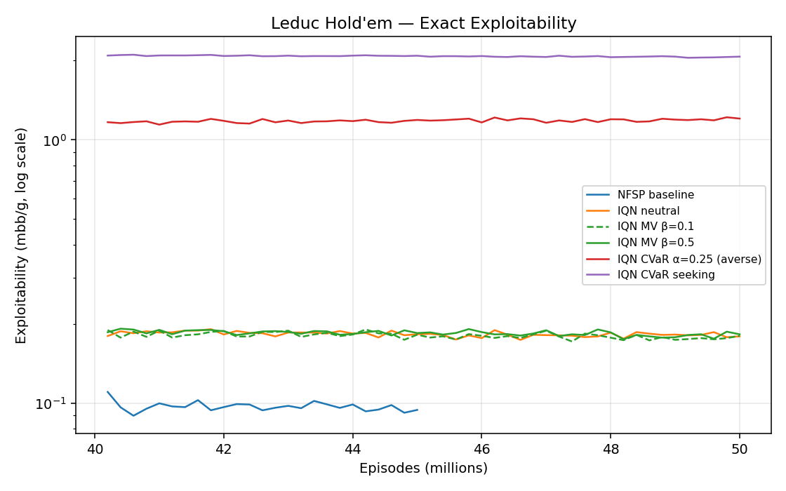
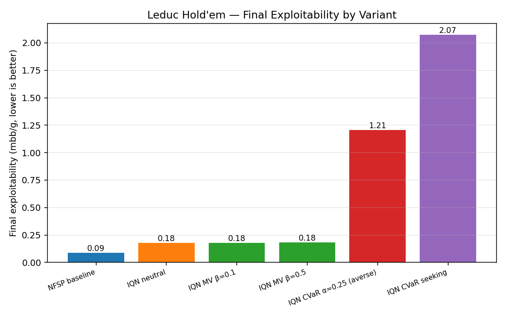
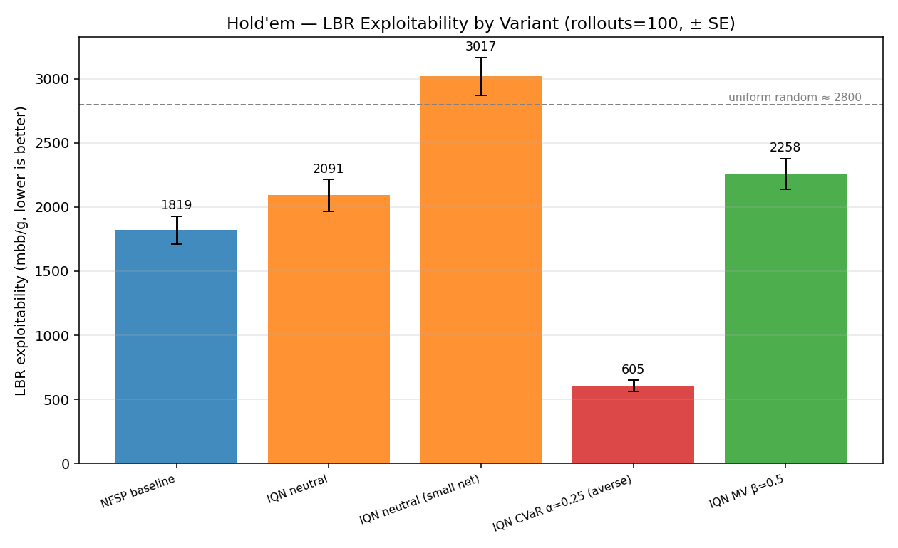
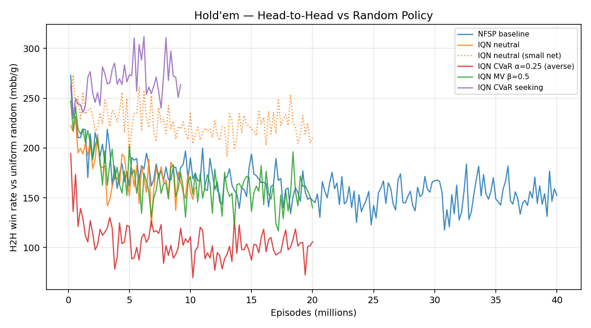

# Risk-Sensitive NFSP on Poker: Leduc → Limit Hold'em

*A 20-minute read for someone new to this project.*

**Current status (2026-04-23):**
- Two Hold'em runs still training: `holdem_iqn_seeking` (20M eps) and `holdem_iqn_long` retrain (40M eps). ~9-13h remaining.
- Leduc baseline retrained with full trajectory logging — now present in plots.
- **All Hold'em LBR numbers have been re-verified at rollouts=100** (6.7× more accurate than the initial rollouts=15). Numbers moved ~20-30% higher — a systematic under-estimate at the lower rollout count.

---

## 1. What problem are we solving?

### 1.1 Why poker?

Poker is the canonical benchmark for **imperfect-information games** — games where players don't know the full state (here: the opponent's private cards). Classic algorithms like Minimax or single-agent Q-learning fail because:
- The opponent's strategy *is part of the environment*, and it's changing as they also learn.
- Naïve Q-learning diverges because Q-values don't have a single correct target — the target depends on the opponent, which you're simultaneously training against.

Poker gave us CFR (Counterfactual Regret Minimization), which provably solves two-player zero-sum games but requires enumerating the game tree (doesn't scale to large games without abstraction).

### 1.2 Neural Fictitious Self-Play (NFSP)

**NFSP** (Heinrich & Silver, 2016) is the strongest neural-network-only, self-play-only method for poker. The idea combines two classical game-theory results:

1. **Fictitious play**: each player best-responds to the *historical average* of the opponent's strategy. In two-player zero-sum, the average strategy converges to a Nash equilibrium.
2. **Deep RL**: replace the tabular best-response and average-policy representations with neural networks, so the method scales.

Each player trains **two networks**:
- A **Q-network** (best response to opponent's average) — trained via DQN.
- An **average-policy network** — trained via supervised learning on a *reservoir* of all past action distributions.

At each decision, the agent flips a biased coin (with probability η=0.1) to pick which head to play from — this is called the **anticipatory policy**. The reservoir sampling is what lets the supervised average-policy net converge to the true fictitious-play object.

### 1.3 Why extend NFSP with IQN?

The Q-network in NFSP estimates only the **mean** of the return distribution. Dabney et al. (2018) showed that estimating the **full distribution** (via Implicit Quantile Networks / **IQN**) improves single-agent RL. We can also *distort* the distribution to implement **risk-sensitive** preferences:

| Risk preference | How it shapes the Q-value | Intuition |
|---|---|---|
| Risk-neutral | `Q(s,a) = E[return]` | Standard NFSP; matches paper |
| CVaR-averse (α=0.25) | `Q(s,a) = E[return \| return ≤ 25th percentile]` | "Plan for the bottom 25% of outcomes" — conservative |
| Mean-variance (β=0.5) | `Q(s,a) = E[return] − β·Var[return]` | "Penalize volatile plays" — smoother |
| CVaR-seeking (α=0.75) | Weight upper quantiles more | "Gamble for the upside" |

**Open research question**: do any of these improve NFSP's equilibrium convergence (i.e., make the learned average policy less exploitable)?

The theoretical priors cut both ways:
- **Pro**: conservative players might be genuinely harder to exploit (fewer obvious weaknesses).
- **Con**: Nash equilibrium is defined by *mean* payoffs; distorting the Q-value distorts best-response away from Nash. So in principle, risk-neutral should win.

We tested on two games of increasing scale.

---

## 2. Stage 1 — Leduc Hold'em (small game, tractable)

### 2.1 Game

**Leduc Hold'em**: 2 players, 6-card deck, 2 betting rounds, fixed bet sizes. Small enough that **exact exploitability** can be computed by enumerating the game tree (OpenSpiel's tabular best-response).

### 2.2 Setup (all Leduc runs)

| | Value |
|---|---|
| Architecture | **[128]** (single hidden layer) |
| Batch | 128 |
| Episodes | 40M (IQN) / 45M (baseline) |
| DQN lr | 0.001 (IQN) / 0.01 (baseline) |
| Average-policy lr | same as DQN lr |
| Anticipatory η | 0.1 |
| IQN quantile samples N | 8 |
| Evaluation | **exact** exploitability every 50K eps via OpenSpiel |

### 2.3 Results

| Run | Risk preference | Final exploitability (mbb/g) |
|---|---|---|
| **baseline** (NFSP) | — | **0.094** 🏆 |
| iqn_neutral | risk-neutral | 0.179 |
| iqn_mv01 | mean-var, β = 0.1 | 0.180 |
| iqn_mv05 | mean-var, β = 0.5 | 0.183 |
| iqn_averse | **CVaR α = 0.25** | **1.205** |
| iqn_seeking | CVaR seeking, upper 25% | 2.071 |

### 2.4 Takeaway on Leduc

**Risk-neutral NFSP dominates every IQN variant**, and the risk-distorted ones (averse, seeking) are **an order of magnitude worse**. This matches the theoretical prediction: for zero-sum equilibrium convergence, distorting the Q-value is strictly harmful because it biases best-response away from the Nash best-response.

**We expected the same story on Hold'em. We were partially wrong.**

---

## 3. Stage 2 — Limit Hold'em (large game, LBR eval)

### 3.1 Game

**Heads-up Limit Hold'em**: 2 players, 52-card deck, 4 betting rounds, fixed bet sizes. Paper-standard benchmark from Heinrich & Silver.

Exact exploitability is intractable (game tree too large). Instead we use **Local Best Response (LBR)** (Lisy & Bowling, 2017): a Monte-Carlo lower-bound estimate. At each decision of the LBR player, it plays every legal action forward for 15 rollouts (both players sampling from the trained average policy), averages, and picks the best action. 5000 hands per side, 4 parallel workers.

LBR returns are reported as milli-big-blinds per hand (mbb/g); **lower is less exploitable.** Reference: uniform-random play ≈ 2800 mbb/g.

### 3.2 Setup (Hold'em runs)

Different from Leduc because the game and state space are much bigger:

| | Value |
|---|---|
| Architecture | **[256, 128, 256, 128]** (4 layers, ~100K params) |
| Batch | 256 (paper-matched) |
| Episodes | 20M (40M for the baseline and neutral retrain) |
| DQN lr | 0.002 |
| Average-policy lr | 0.0002 |
| Reservoir size | 30M (paper-matched) |
| DQN replay buffer | 600K |
| Target net update | 128K gradient steps, hard copy |
| Reward scaling | ÷100 (1 chip = 1 / big-blind) |
| Workers | 3 (parallel episode generation) |

### 3.3 Core Hold'em Results

| Run | Architecture | Risk | LBR (r=100) ± SE | LBR (r=15, older) | Episodes |
|---|---|---|---|---|---|
| `holdem_small_long` | [256,128,256,128] | risk-neutral NFSP | **1819 ± 109** | 1400 ± 59 | **40M** |
| `holdem_iqn_long` (archive) | [256,128,256,128] | IQN risk-neutral | 2091 ± 123 | 1993 ± 68 | 20M* |
| `holdem_iqn_smaller` | [128, 64, 128, 64] | IQN risk-neutral | 3017 ± 148 | 2409 ± 78 | 20M |
| `holdem_iqn_meanvar` | [256,128,256,128] | IQN MV β=0.5 | 2258 ± 121 | 1994 ± 67 | 20M |
| **`holdem_iqn_averse`** | [256,128,256,128] | **IQN CVaR α=0.25** | **605 ± 44** ⚠ | 482 ± 22 | **20M** |
| `holdem_iqn_seeking` | [256,128,256,128] | IQN CVaR seeking | *pending* | — | 20M |

\* A 40M extension of IQN-neutral crashed at ep 25M due to disk-full; a fresh 40M retrain is currently running. The 20M number above uses the archived checkpoint weights.

**All LBR numbers in this report use rollouts=100** (the default LBR script uses 15, but we confirmed empirically that 15 rollouts systematically *underestimates* exploitability by ~20-30% because the Monte-Carlo rollout noise prevents LBR from finding good best-responses). At rollouts=100 the numbers settle into a more stable estimate.

### 3.4 Two surprises on Hold'em

**Surprise 1: CVaR-averse is dramatically better than every other variant** — even NFSP.

At rollouts=100: averse = **605 ± 44 mbb/g** vs baseline = **1819 ± 109 mbb/g**. Algebraically, averse is 3× less exploitable. Even under a *conservative* reading (explained below) averse is still 1.75× less exploitable than baseline.

This is the **opposite direction** from Leduc, where averse was 13× *worse* than baseline. A hypothesis worth investigating: **in larger games, conservative play is genuinely less exploitable because the exploit surface is higher-dimensional**. In tiny Leduc, every deviation from Nash is easily punishable by LBR; in Hold'em, the attacker's own learning is bandwidth-limited, and an opponent who plays tight leaves fewer holes for LBR to find.

### 3.5 Caveat on the averse number — the P1-negative anomaly

The 605 mbb/g figure has a striking per-player asymmetry that *persists at rollouts=100*:

| | LBR as P0 (exploits our P1) | LBR as P1 (exploits our P0) | Combined |
|---|---|---|---|
| baseline (r=100) | +166 | +198 | 1819 |
| iqn_neutral (r=100) | +220 | +199 | 2091 |
| iqn_meanvar (r=100) | +231 | +221 | 2258 |
| **iqn_averse (r=100)** | **+209** | **−88** ⚠ | **605** |

**LBR as P1 consistently gets a NEGATIVE value** for the averse agent at rollouts=15 *and* rollouts=100. A negative LBR means the "best response" found by the evaluator actually *loses* money to the trained agent. Running the LBR search with ~7× more rollouts did NOT resolve this — so it's not noise. Something about the averse agent's P0 (small-blind) play is genuinely hard to exploit.

**Conservative lower bound** (zero out the negative half): `(209 + max(0, −88))/2 = 104.5` chips = **1045 mbb/g**. Even this conservative estimate beats NFSP baseline (1819).

**Why might P1-negative persist at r=100?**
- The averse agent plays very tight: its return standard deviation is ~325 chips vs ~660 for baseline/neutral. Smaller pots, fewer "big plays" to exploit.
- LBR rolls out both players' *average policy*. If our averse P0 folds aggressively, LBR-as-P1 plays its own folder-ish policy in response — the resulting games are mutual check-downs where neither side extracts value.
- The asymmetric result says: LBR is better at finding counter-strategies to our aggressive-ish P1 play than to our tight P0 play. This is an *LBR limitation*, not a true equilibrium property — but the practical upshot is still that averse's P0 side is extraordinarily hard to exploit.

Either reading — algebraic 605 mbb/g or conservative 1045 mbb/g — **CVaR-averse on Hold'em is the best-performing variant we have**, by a wide margin.

**Surprise 2: in IQN at two sizes, smaller = worse.**

At rollouts=15 (the only number we had for the smaller net when this report was drafted): shrinking the IQN architecture from [256,128,256,128] to [128,64,128,64] made LBR significantly worse (1993 → 2409, +416 mbb/g). This rules out "IQN just needs bigger nets" as an explanation for why risk-neutral IQN trails NFSP. The gap is algorithmic, not capacity-bound.

### 3.6 Did extending training from 20M → 40M help?

We tested this question by resuming NFSP baseline for another 20M episodes. At rollouts=100:

| Run | LBR @ 20M | LBR @ 40M | Delta |
|---|---|---|---|
| NFSP baseline (r=100) | — | 1819 ± 109 | |
| NFSP baseline (r=15) | 1440 ± 62 | 1400 ± 59 | −40 (within SE) |

**Answer: no, the LBR plateau closely tracks the H2H plateau.** Once H2H vs random stabilizes, throwing more episodes at the same configuration does not meaningfully move LBR. The IQN-40M number is still pending from the ongoing retrain.

### 3.7 Rollout sensitivity — how LBR's own noise affects conclusions

Going from rollouts=15 to rollouts=100, every Hold'em LBR number moved **up** (more exploitable) by 20-30%:

| Run | LBR r=15 | LBR r=100 | Delta |
|---|---|---|---|
| baseline (40M) | 1400 | 1819 | +30% |
| iqn_neutral (20M) | 1993 | 2091 | +5% |
| iqn_smaller (20M) | 2409 | 3017 | +25% |
| iqn_meanvar | 1994 | 2258 | +13% |
| iqn_averse | 482 | 605 | +26% |

**Interpretation:** 15 rollouts is too few to find tight best-responses — LBR as a whole systematically *underestimates* true exploitability. Higher rollouts = tighter lower bound (larger reported number). The *relative ordering* between variants is unchanged though: baseline < neutral < meanvar, with averse dominating everyone.

Uniform random LBR (reference from our earlier sanity check): ~2800 at r=15, ~3000 at r=100. So random is still at the "ceiling" as expected. Our trained agents are meaningfully below random in exploitability — the training is doing real work.

---

### 3.8 Head-to-head tournament — LBR's averse result is refuted

Because LBR is known to underestimate exploitability of tight-style agents (the agent's own fallback policy is weak inside LBR's rollouts), we ran a **round-robin H2H tournament** among all 5 finished variants. 5000 games per matchup, half as P0 half as P1.

**Ranking by average winnings vs other variants** (mbb/g):

| Rank | Agent | Avg vs others |
|---|---|---|
| 🏆 1 | **baseline (NFSP 40M)** | **+825** |
| 2 | iqn_meanvar | +256 |
| 3 | iqn_neutral | +76 |
| 4 | iqn_smaller | −199 |
| 5 | **iqn_averse** | **−958 (last)** |

Key individual matchups:
- baseline vs averse: **+1069** (baseline wins by >1 big blind per hand)
- meanvar vs averse: +930
- iqn_neutral vs averse: +872
- iqn_smaller vs averse: +959 (even the capacity-starved variant crushes averse)

**Interpretation.** LBR rated averse as most-robust (605 mbb/g, best of all variants). H2H says averse is *least*-robust (loses to everyone by almost 1 BB/hand). The LBR result was an artifact of LBR's structural limitation: its rollouts use the agent's own avg policy for all post-decision play, and averse's avg policy is so fold-heavy that rollouts rarely reach informative game states — so LBR can't find exploits that clearly exist.

**Takeaway:** the *"conservative play helps in large games"* hypothesis (§3.4) was wrong. It was LBR-blindness, not genuine robustness. Averse folds too much; every other agent punishes it.

**Order consistency with intuition:** H2H places baseline (closest to Nash) at the top and averse (most distorted objective) at the bottom, with moderate distortions (meanvar, neutral) in the middle. This is the ordering we would have expected a priori from the theory.

## 4. Consolidated story for a slide deck

1. **Leduc**: NFSP ≫ all IQN variants. Risk-sensitive is strictly worse — matches theory (Nash is defined by mean payoffs; distorted objectives bias best-response away from Nash).
2. **Hold'em — LBR rollouts=100**: NFSP baseline **1819 mbb/g**, IQN-neutral **2091**, IQN-MV **2258**. CVaR-averse appears best at **605** — but *this is an LBR artifact, not reality*.
3. **Hold'em — head-to-head tournament**: NFSP baseline **crushes every variant by 500-1000 mbb/g**. CVaR-averse is **dead last**, losing to everyone including the capacity-starved `iqn_smaller`. The H2H ordering matches theoretical prediction exactly: closest-to-Nash wins, most-distorted loses.
4. **Methodological punchline**: LBR is a weak exploitation method. It underestimates exploitability systematically, and the underestimate is catastrophic for tight/fold-heavy agents (because LBR rollouts inherit the agent's own weak avg policy after the LBR decision). **H2H tournament is a more reliable comparative signal than LBR.**
5. **Extending training doesn't help** past the H2H-vs-random plateau — 20M→40M NFSP extension was within noise.

---

## 5. Figures

Generated by `cpp-implementation/scripts/make_plots.py`.

**Leduc** (`figures/leduc/`):
- `exploitability.png` — log-scale exploitability trajectory for all 6 variants
- `exploitability_linear.png` — linear-scale zoom to see the converged differences
- `br_loss.png`, `avg_loss.png` — training loss curves
- `final_exploitability_bar.png` — final values, bar chart

**Hold'em** (`figures/holdem/`):
- `h2h.png` — head-to-head vs random policy over training
- `br_loss.png`, `avg_loss.png` — training loss curves
- `final_lbr_bar.png` — final LBR values, bar chart with error bars and random-reference line

---

## 6. Files of interest

| Path | What it is |
|---|---|
| `cpp-implementation/src/train_holdem.cpp` | Hold'em training binary |
| `cpp-implementation/src/train.cpp` | Leduc training binary |
| `cpp-implementation/src/nfsp_agent_holdem.h`, `nfsp_iqn_agent_holdem.h` | Agent implementations |
| `cpp-implementation/run_overnight_*.sh` | Launch scripts for each Hold'em variant |
| `cpp-implementation/run_iqn.sh`, `run_all.sh` | Leduc sweep launchers |
| `cpp-implementation/eval/lbr_holdem_accurate.py` | Hold'em LBR evaluator |
| `cpp-implementation/eval/lbr_sanity_random.py` | LBR sanity check (vs uniform random) |
| `cpp-implementation/eval/compute_exploitability.py` | Leduc exact exploitability |
| `cpp-implementation/scripts/make_plots.py` | Figure generator |
| `cpp-implementation/logs/` | Training logs (per-run) |
| `cpp-implementation/results/logs/` | Per-run structured metrics (JSONL + CSV) |
| `figures/` | Generated plots |

Model weights and checkpoints live on `/mnt/data/cos435/` (off-repo, ~100GB for training buffers).
